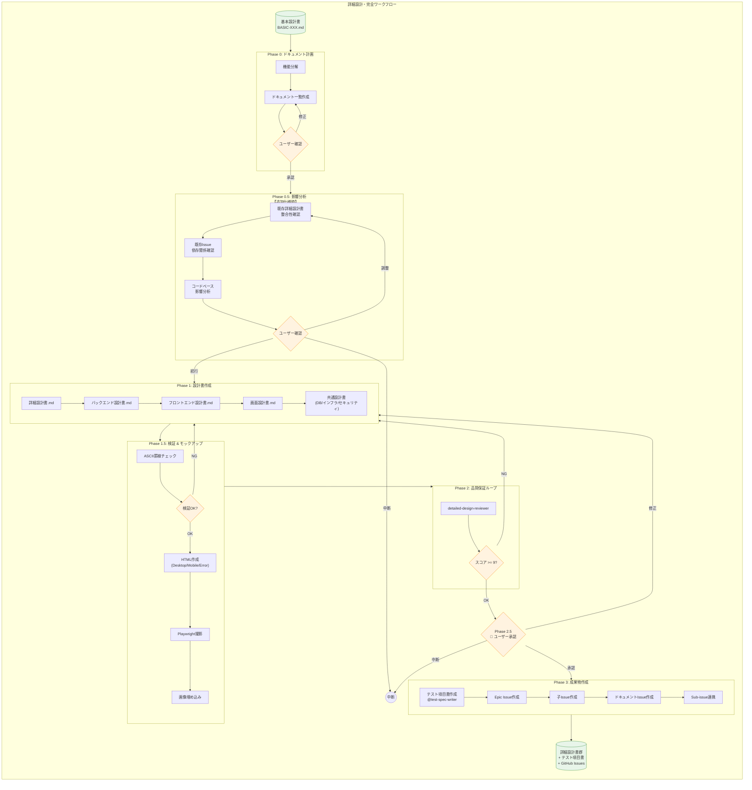
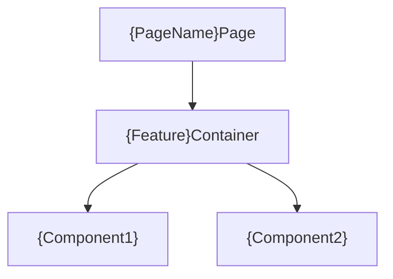
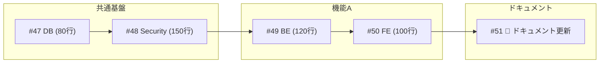

# 詳細設計・完全ワークフロー (v2.9)

基本設計書を入力として、詳細設計書を作成し、モックアップ生成とテスト設計までを一貫して行うワークフロー。

## 入力

$ARGUMENTS（基本設計書のパス）

## 全体フロー図



---

**変更点(v2.9)**:
- **ドキュメント更新Issue自動作成**: 実装Issue作成後、README.md/USAGE.md/CHANGELOG.md等のドキュメント更新IssueをEpicのSub-issueとして自動作成。

**変更点(v2.8)**:
- **Sub-issue登録をGraphQL APIに変更**: REST APIのバグ（HTTP 500/404）を回避するため、GraphQL APIを使用するように修正。

**変更点(v2.7)**:
- **Sub-issue連携の自動化**: Epic Issueと子Issueを作成後、GitHub Sub-issues機能を使って親子関係を自動設定（decompose-issueと同等機能）。

**変更点(v2.6)**:
- **既存システム影響分析の追加**: Phase 0.5で既存詳細設計書・Issue・コードベースへの影響を分析。追加仕様時に整合性を確保。

**変更点(v2.5)**:
- **ASCII自動検証の追加**: Phase 1完了時に画面設計書のASCII禁止チェックを自動実行（grepベース）。
- **禁止パターン拡大**: ページネーション表示例、ローディング状態、カード形式のASCII表現も明示的に禁止。
- **Issue依存関係のMermaid必須化**: Epic IssueのDependency図はMermaid形式で記述。ASCII禁止。

**変更点(v2.4)**:
- **ドキュメント計画フェーズ追加**: 設計書作成前にドキュメント一覧を提示し、ユーザー承認を得るプロセスを追加。

**変更点(v2.3)**:
- **画面設計書からASCII wireframe禁止**: 視覚表現はHTMLモックアップ/スクリーンショットのみ。
- **モバイルHTML固定幅方式**: レイアウト崩れを100%防止するテンプレート追加。
- **HTML構造ルール強化**: 崩れないレイアウトのための必須ルール追加。

**変更点(v2.2)**:
- **フロントエンド設計書の必須化**: 画面を持つ機能には`フロントエンド設計書.md`を必須化。
- **Phase 1の明確化**: 各機能タイプごとに作成すべき設計書を明示。

**変更点(v2.1)**:
- **モックアップ方針の変更**: High-fidelityではなく、**Low-fidelity Wireframe** を作成する。
- **モバイル対応**: モバイルビューのスクリーンショットも必須化。
- **UIパーツ網羅**: トーストやモーダル等の状態もHTML/画像化する。

---

## 実行プロセス

### Phase 0: ドキュメント計画 & 承認 (v2.4 NEW)

**目的**: 基本設計書に基づき、作成すべき詳細設計書の一覧を定義し、抜け漏れを防ぐ。

1. **機能分解 & ドキュメントリストアップ**:
   - 基本設計書を分析し、必要なサブ機能とドキュメントを特定する。
   - 機能タイプ（画面あり、APIのみ、バッチ等）に応じて必須ドキュメントを判定。
2. **ユーザー確認**:
   - 作成予定のドキュメント一覧（ファイルパス案）をユーザーに提示する。
   - 「不足している設計書はないか？」「追加すべき設計書はないか？」を確認する。
   - ユーザーの承認（または修正指示）を得てから Phase 0.5 に進む。

---

### Phase 0.5: 既存Issue・コードベースへの影響分析【追加仕様時必須】 (v2.6 NEW)

> **トリガー**: 以下のいずれかに該当する場合
> - `docs/designs/detailed/` に既存の詳細設計書が存在する
> - GitHub に既存の関連Issueが存在する
> - `src/` に既存のコードベースが存在する

**目的**: 追加仕様が既存の実装・Issueと整合性があることを確認し、影響範囲を特定する。

**実行内容:**

#### 1. 既存詳細設計書との整合性確認

```bash
# 既存詳細設計書の特定
ls docs/designs/detailed/*/README.md
```

| チェック項目 | 確認内容 | 矛盾時のアクション |
|-------------|---------|------------------|
| API互換性 | 既存APIシグネチャを破壊しないか | 後方互換性を維持 or マイグレーション計画 |
| 型定義互換性 | 既存の型定義と矛盾しないか | 型拡張 or 新規型定義 |
| エラーコード | 既存エラーコードと重複しないか | 連番を調整 |
| テスト項目 | 既存テスト項目に影響しないか | 回帰テストを追加 |

#### 2. 既存GitHub Issueとの関連確認

```bash
# 関連Issueの検索
gh issue list --search "is:open label:implementation"
gh issue list --search "is:open [関連キーワード]"
```

| チェック項目 | 確認内容 | アクション |
|-------------|---------|----------|
| 依存Issue | 新規Issueが既存Issueに依存するか | 依存関係を明記 |
| 競合Issue | 同一ファイルを変更するIssueがあるか | 実装順序を調整 or マージ |
| ブロックされるIssue | 新規Issueにより既存Issueがブロックされるか | 優先順位を調整 |

#### 3. 既存コードベースへの影響分析

```bash
# 変更対象ファイルの特定
# 新規機能が触れるモジュールを分析
```

| チェック項目 | 確認内容 | アクション |
|-------------|---------|----------|
| 既存モジュール変更 | 既存 `src/` のどのファイルを変更するか | 変更ファイル一覧を作成 |
| 新規モジュール追加 | どこに新規ファイルを追加するか | ディレクトリ構造を確認 |
| 依存関係変更 | `Cargo.toml` / `package.json` の変更があるか | 依存追加を明記 |
| 公開API変更 | `lib.rs` / `mod.rs` の変更があるか | 公開範囲を確認 |

#### 4. 影響分析レポート作成

```markdown
## 既存システムへの影響分析レポート

### 関連する既存詳細設計書
| ドキュメント | 関連度 | 影響 |
|-------------|--------|------|
| backend-api.md | 高 | 新規エンドポイント追加 |
| frontend-screens.md | 中 | 新規画面追加 |

### 関連する既存Issue
| Issue | タイトル | 関連 | アクション |
|-------|---------|------|----------|
| #8 | ダッシュボードUI実装 | 依存 | #8完了後に着手 |
| #15 | ドキュメント整備 | 影響なし | - |

### コードベース影響分析
| 影響種別 | ファイル/モジュール | 変更内容 |
|---------|-------------------|---------|
| 変更 | src/api/routes.ts | 新規APIルート追加 |
| 変更 | src/types/index.ts | 新規型定義追加 |
| 新規 | src/features/statistics/ | 統計モジュール新規作成 |
| 依存追加 | package.json | 必要なパッケージ追加 |

### リスク評価
| リスク | 影響度 | 対策 |
|--------|--------|------|
| 既存テストの破壊 | 中 | 回帰テストを先に実行 |
| 型定義の互換性 | 低 | 拡張のみ、破壊的変更なし |
```

#### 5. ユーザー確認（影響がある場合）

```markdown
⚠️ 既存システムへの影響が検出されました。

**影響サマリー**:
- 既存設計書への影響: 2件
- 関連Issue: 1件（依存関係あり）
- 変更ファイル: 3件
- 新規ファイル: 1件

**依存関係**:
- Issue #8（メニューバーUI）完了後に着手可能

**対応方針を選択してください**:
- `続行` → 影響を認識した上でPhase 1へ進む
- `調整` → 依存関係・優先順位を調整
- `中断` → 確認後に再開
```

**スキップ条件:**
- `docs/designs/detailed/` に既存詳細設計書が存在しない（新規プロジェクト）
- `src/` に既存コードが存在しない（新規プロジェクト）
- ユーザーから「影響分析スキップ」と明示的に指示された場合

**完了条件:**
- 既存詳細設計書との整合性チェック完了
- 既存Issueとの依存関係確認完了
- コードベース影響分析完了
- 影響がある場合はユーザー確認済み

---

### Phase 1: 機能分割 & ドラフト作成

`detailed-design-writer` エージェントが各サブ機能に対して設計書を作成する。

#### 1.1 機能タイプ別 必須設計書

| 機能タイプ | 詳細設計書 | バックエンド | フロントエンド | 画面設計書 | その他 |
|-----------|:----------:|:------------:|:--------------:|:----------:|--------|
| **画面あり機能** | ✅ | ✅ | ✅ | ✅ | - |
| **API専用機能** | ✅ | ✅ | - | - | - |
| **バッチ処理** | ✅ | ✅ | - | - | - |
| **外部連携** | ✅ | ✅ | - | - | 外部API連携設計書 |
| **通知機能** | ✅ | ✅ | - | - | 通知設計書 |

#### 1.2 共通設計書（機能群ごとに1つ）

| 設計書 | 必須 | 内容 |
|--------|:----:|------|
| `データベース設計書.md` | ✅ | テーブル定義、ER図、インデックス設計 |
| `インフラ設計書.md` | ✅ | 構成図、スケーリング、監視設計 |
| `セキュリティ設計書.md` | ✅ | 認証認可、暗号化、監査ログ設計 |

---

#### 1.3 フロントエンド設計書テンプレート

画面を持つ機能には以下の構成で `フロントエンド設計書.md` を作成する。

```markdown
# {機能名} フロントエンド設計書

## メタ情報
| 項目 | 内容 |
|------|------|
| ドキュメントID | DETAIL-{機能ID}-FRONTEND-001 |
| 親設計書 | [詳細設計書.md](./詳細設計書.md) |

---

## 1. コンポーネント構成

### 1.1 コンポーネント階層図



### 1.2 コンポーネント一覧

| コンポーネント名 | 種類 | 責務 | Props |
|----------------|------|------|-------|
| `{Feature}Page` | Page | ルーティング、レイアウト | - |
| `{Feature}Container` | Container | 状態管理、API呼び出し | - |
| `{Component}` | Presentational | UI表示 | `data`, `onAction` |

---

## 2. 状態管理設計

### 2.1 状態の種類と管理方針

| 状態 | スコープ | 管理方法 | 永続化 |
|------|---------|---------|--------|
| ユーザー認証 | グローバル | Zustand/Context | LocalStorage |
| フォーム入力 | ローカル | useState/useForm | - |
| サーバーデータ | キャッシュ | React Query/SWR | - |

### 2.2 グローバル状態

```typescript
interface {Feature}State {
  // 状態の型定義
}
```

---

## 3. カスタムフック設計

| フック名 | 責務 | 引数 | 戻り値 |
|---------|------|------|--------|
| `use{Feature}` | {機能}のロジック | - | `{ data, isLoading, error }` |
| `use{Feature}Mutation` | データ更新 | - | `{ mutate, isPending }` |

### 3.1 フック実装詳細

```typescript
// use{Feature}.ts
export function use{Feature}() {
  // 実装概要
}
```

---

## 4. API連携設計

### 4.1 使用エンドポイント

| API | メソッド | 用途 | フック |
|-----|---------|------|--------|
| `/api/xxx` | GET | データ取得 | `use{Feature}Query` |
| `/api/xxx` | POST | データ作成 | `use{Feature}Mutation` |

### 4.2 エラーハンドリング

| エラーコード | 画面表示 | リカバリ方法 |
|------------|---------|-------------|
| 400 | バリデーションエラー表示 | フォーム修正を促す |
| 401 | ログイン画面へリダイレクト | - |
| 500 | エラーメッセージ表示 | リトライボタン |

---

## 5. フォームバリデーション

### 5.1 クライアント側バリデーション

| フィールド | ルール | ライブラリ | エラーメッセージ |
|-----------|--------|-----------|-----------------|
| email | 必須, メール形式 | zod/yup | メールアドレスを入力してください |

### 5.2 バリデーションスキーマ

```typescript
const {feature}Schema = z.object({
  // スキーマ定義
});
```

---

## 6. ルーティング設計

| パス | コンポーネント | 認証 | ガード |
|-----|--------------|:----:|--------|
| `/xxx` | `{Feature}Page` | ✅ | `AuthGuard` |

---

## 7. 再利用可能コンポーネント

### 7.1 プロジェクト共通コンポーネント使用

| コンポーネント | 用途 | カスタマイズ |
|--------------|------|-------------|
| `Button` | アクションボタン | variant="primary" |
| `Input` | テキスト入力 | - |
| `Modal` | 確認ダイアログ | - |

### 7.2 新規作成コンポーネント

| コンポーネント | 用途 | 汎用性 |
|--------------|------|--------|
| `{Feature}Card` | 専用カード | 機能固有 |

---

## 8. パフォーマンス考慮

| 最適化項目 | 実装方法 |
|-----------|---------|
| 不要な再レンダリング防止 | `React.memo`, `useMemo`, `useCallback` |
| 遅延読み込み | `React.lazy`, `Suspense` |
| 仮想スクロール | `react-virtuoso` (大量データ時) |

---

## 9. テスト方針

| テスト種別 | 対象 | ツール |
|-----------|------|--------|
| Unit | カスタムフック | Jest, React Testing Library |
| Integration | Container + API | MSW |
| E2E | ユーザーフロー | Playwright |

---

## 変更履歴

| 日付 | バージョン | 変更内容 | 担当者 |
|:---|:---|:---|:---|
| YYYY-MM-DD | 1.0.0 | 初版作成 | - |
```

---

#### 1.4 画面設計書の記述ルール（v2.3 NEW）

**禁止事項**:
- ❌ ASCII art / テキストベースのワイヤーフレーム
- ❌ 罫線文字（┌─┐│└┘等）を使った図表現
- ❌ コードブロック内のUI表現

**必須事項**:
- ✅ 視覚表現は**HTMLモックアップ + スクリーンショット画像のみ**
- ✅ 状態の説明は**表形式**または**箇条書き**で記述
- ✅ エラーメッセージ等は**テキストのみ**記載（視覚的表現はmockup-error.htmlで）

**NG例（これを書いてはいけない）**:

```markdown
❌ 禁止1: ボックス罫線
┌─────────────────────────────────────┐
│ ⚠ エラーメッセージ                   │
└─────────────────────────────────────┘

❌ 禁止2: カード形式のASCII表現
┌─────────────────────────────────────┐
│ 2026-01-15 10:30:00                 │
│ 操作者: admin@example.com            │
│ 種別: [編集]                         │
└─────────────────────────────────────┘

❌ 禁止3: ページネーション表示例
[前へ] [1] [2] [3] [4] [5] ... [次へ]

❌ 禁止4: ボタン状態のASCII表現
[  ⏳ 検索中...  ]

❌ 禁止5: ツリー構造のASCII表現
├── Header
│   ├── Logo
│   └── Navigation
└── Footer
```

**OK例（こう書く）**:
```markdown
### エラー表示
| 状態 | メッセージ | 表示位置 |
|------|-----------|---------|
| バリデーションエラー | 入力内容を確認してください | フォーム上部 |

> 視覚的な表示はHTMLモックアップおよびスクリーンショットで確認（Phase 2で生成）
```

---

### Phase 1.5: 検証 & モックアップ生成 (Wireframe Mode)

**目的**: 設計書の品質検証（ASCII禁止）と、視覚的な確認（モックアップ）を行う。

1. **ASCII禁止 自動検証 (v2.5 NEW)**:
   - 画面設計書に罫線文字が含まれていないかチェック。
   - 違反がある場合はPhase 1に戻り修正。

2. **モックアップ生成 (Phase 2から統合)**:
   - `mockup.html` (Desktop), `mockup-mobile.html` (Mobile), `mockup-error.html` 作成。
   - Playwrightでスクリーンショット撮影。
   - 画面設計書に画像を埋め込み。

---

### Phase 2: 品質保証ループ (Review Loop)

1. `detailed-design-reviewer` によるレビュー (9点以上合格)。
2. モックアップが**ワイヤーフレームとして構造が正しいか**確認。
3. **フロントエンド設計書の存在確認**: 画面を持つ機能に`フロントエンド設計書.md`が存在するか確認。
4. **モバイルHTML固定幅チェック**: `width: 375px`固定確認。
5. **はみ出しチェック**: スクリーンショット確認。

---

### Phase 2.5: ユーザー承認ゲート【必須】

> **共通仕様**: {{skill:approval-gate}} を参照

レビューループ完了後、成果物作成に進む前にユーザーの承認を得る。

---

### Phase 3: 成果物作成 & Issue化

1. **テスト項目書作成**: `test-spec-writer` が詳細設計書を元に作成。
2. **Issue化**:
   - Epic Issue作成
   - 子Issue作成（200行以下に分割）
   - **ドキュメント更新Issue作成**（実装完了後に必要なドキュメント整備）
   - Sub-issue連携（GraphQL API使用）
   - 依存関係図作成（Mermaid）
> **重要**: Issueは**200行以下・3ファイル以下**の粒度で作成する。

**GitHub Issue作成**: 実装タスクを**適切な粒度で**Issue化する。

#### 5.0 Issue粒度ルール（v3.0 NEW - 必須）

> **⛔ 大きなIssueは作成禁止**: 200行超または3ファイル超のIssueは分割する。

| 制約 | 上限 | 違反時のアクション |
|------|------|------------------|
| **コード量** | 200行以下 | 複数Issueに分割 |
| **ファイル数** | 1-3ファイル | 複数Issueに分割 |
| **責務** | 単一責務 | 機能ごとに分割 |

**粒度判定フロー**:

```python
def estimate_issue_size(design_doc_section) -> IssueSize:
    """設計書のセクションから推定コード量を計算"""
    
    # 推定ルール（目安）
    estimation_rules = {
        "struct/enum定義": 20,      # 1つあたり20行
        "trait実装": 50,            # 1つあたり50行
        "関数/メソッド": 30,        # 1つあたり30行
        "テストケース": 15,         # 1つあたり15行
        "エラー型": 10,             # 1つあたり10行
    }
    
    total_lines = 0
    for item_type, count in design_doc_section.items():
        total_lines += estimation_rules.get(item_type, 20) * count
    
    return IssueSize(
        estimated_lines=total_lines,
        needs_split=total_lines > 200
    )
```

**分割例**:

```
Before（NG）:
  Issue #8: メニューバーUI実装（推定500行、5ファイル）

After（OK）:
  Issue #8-1: コンポーネント初期化（推定80行、1ファイル）
  Issue #8-2: UI項目定義（推定120行、1ファイル）
  Issue #8-3: 状態表示ロジック（推定100行、1ファイル）
  Issue #8-4: API連携（推定150行、2ファイル）
  Issue #8-5: テスト追加（推定50行、1ファイル）
```

#### 5.1 Issue作成ルール

**Epic Issue構成**:
- 概要
- 関連ドキュメント
- スコープ（機能一覧）
- 技術スタック
- 工数見積もり
- 子Issue一覧（**各200行以下**）
- **ドキュメント更新Issue**（実装完了後のドキュメント整備）← v2.9
- **依存関係（Mermaid形式で記述）**

**依存関係の記述方法**:

❌ **禁止: ASCII形式**
```
#47 (DB) ─┬─> #48 (Security) ─┬─> #49 (Auth BE)
          │                   │
          └───────────────────┴─> #53 (Detail BE)
```

✅ **必須: Mermaid形式**
````markdown

````

**子Issueの構成（粒度最適化版）**:
- 概要
- 親Issue参照
- 設計書リンク
- **推定コード量**（例: 120行）
- **対象ファイル**（例: `src/menubar/menu.rs`）
- 実装内容
- 完了条件
- 依存（あれば）

#### 5.2 Issue作成テンプレート（子Issue）

```markdown
## 概要
{1-2文で機能を説明}

## 親Issue
- Epic: #{epic_issue_number}

## 設計書
- [{設計書名}]({path_to_design_doc})

## 推定規模
| 項目 | 値 |
|------|-----|
| コード量 | {XX}行 |
| ファイル数 | {N}件 |

## 対象ファイル
- `{path/to/file1.rs}` (新規 / 変更)
- `{path/to/file2.rs}` (新規 / 変更)

## 実装内容
- [ ] {実装項目1}
- [ ] {実装項目2}

## 完了条件
- [ ] 実装完了（200行以下）
- [ ] テスト通過
- [ ] Clippy警告なし
- [ ] レビュー9点以上

## 依存
- #{依存するIssue番号}（このIssue完了後に着手可能）
```

#### 5.2.1 ドキュメント更新Issue（v2.9 NEW）

実装完了後に必要なドキュメント整備をIssue化する。

**作成条件**:

| ドキュメント | 作成条件 | ラベル |
|-------------|---------|--------|
| `README.md` | 新規機能追加 または 既存README存在時 | `documentation` |
| `USAGE.md` | CLI/API変更時 | `documentation` |
| `CHANGELOG.md` / `RELEASE.md` | 全実装完了後（**必須**） | `documentation`, `release` |

**依存関係**: 全実装Issueが完了後に着手可能。

**Sub-issue登録**: ドキュメント更新IssueもEpic IssueのSub-issueとして登録する（実装Issueと同様）。

**テンプレート（ドキュメント更新Issue）**:

```markdown
## 概要
{機能名}の実装完了に伴い、関連ドキュメントを更新する。

## 親Issue
- Epic: #{epic_issue_number}（**Sub-issueとして登録**）

## 対象ドキュメント
| ファイル | 更新内容 | 必須/任意 |
|----------|---------|----------|
| `README.md` | {機能概要、インストール手順、使用例の追記} | 必須 |
| `USAGE.md` | {新規コマンド/APIの使用方法} | {該当時のみ} |
| `CHANGELOG.md` | {変更履歴の追記} | 必須 |

## 更新内容
- [ ] README.md: 機能概要セクションに{機能名}を追加
- [ ] README.md: 使用例セクションにサンプルコードを追加
- [ ] USAGE.md: 新規CLI/APIコマンドのドキュメント追加
- [ ] CHANGELOG.md: バージョン・変更内容・日付を追記

## 完了条件
- [ ] 全対象ドキュメントが更新されている
- [ ] マークダウンの構文エラーがない
- [ ] リンク切れがない（相対パス確認）
- [ ] 既存フォーマットとの整合性が取れている

## 依存
- 全実装Issue完了後に着手可能
```

#### 5.3 分割が必要な場合の手順

```python
def create_issues_with_optimal_granularity(design_doc):
    """設計書から適切な粒度のIssueを作成"""
    
    # 1. 設計書の各セクションを分析
    sections = analyze_design_doc(design_doc)
    
    # 2. 各セクションの推定コード量を計算
    issues_to_create = []
    for section in sections:
        size = estimate_issue_size(section)
        
        if size.estimated_lines <= 200:
            # そのままIssue化
            issues_to_create.append(section)
        else:
            # 分割が必要
            sub_sections = split_section(section, max_lines=200)
            issues_to_create.extend(sub_sections)
    
    # 3. 依存関係を解析
    dependencies = analyze_dependencies(issues_to_create)
    
    # 4. Issue作成（依存関係順）
    created_issues = []
    for issue_data in topological_sort(issues_to_create, dependencies):
        issue = gh_issue_create(
            title=f"[{epic_label}] {issue_data.title}",
            body=format_issue_body(issue_data),
            labels=["implementation", f"~{issue_data.estimated_lines}行"]
        )
        created_issues.append(issue)
    
    # 5. Epic Issueに子Issue一覧を追加
    update_epic_with_children(epic_issue, created_issues)
    
    # 6. 子IssueをSub-issueとしてEpicに登録
    # 詳細: {{skill:github-graphql-api}}
    for child in created_issues:
        add_sub_issue(epic_issue.number, child.number)
    
    # 7. ドキュメント更新Issueを作成（v2.9 NEW）
    doc_issues = create_documentation_issues(epic_issue, created_issues, design_doc)
    for doc_issue in doc_issues:
        add_sub_issue(epic_issue.number, doc_issue.number)
    
    return created_issues + doc_issues


def create_documentation_issues(epic_issue, impl_issues, design_doc):
    """実装完了後に必要なドキュメント更新Issueを作成"""
    
    doc_issues = []
    feature_name = extract_feature_name(design_doc)
    
    # 更新対象ドキュメントを判定
    docs_to_update = []
    
    # README.md: 新規機能追加時は必須
    if path_exists("README.md") or is_new_feature(design_doc):
        docs_to_update.append({
            "file": "README.md",
            "action": "機能概要・使用例の追記",
            "required": True
        })
    
    # USAGE.md: CLI/API変更時
    if has_cli_changes(design_doc) or has_api_changes(design_doc):
        docs_to_update.append({
            "file": "USAGE.md",
            "action": "コマンド/API使用方法の追記",
            "required": True
        })
    
    # CHANGELOG.md: 常に必須
    docs_to_update.append({
        "file": "CHANGELOG.md",
        "action": "変更履歴の追記",
        "required": True
    })
    
    # ドキュメント更新Issueを作成
    if docs_to_update:
        doc_issue = gh_issue_create(
            title=f"[{epic_label}] 📝 ドキュメント更新: {feature_name}",
            body=format_doc_issue_body(docs_to_update, impl_issues),
            labels=["documentation"]
        )
        doc_issues.append(doc_issue)
    
    return doc_issues
```

---

## サーキットブレーカー & リカバリ

- **モックアップ生成失敗**: シンプルなHTMLなので失敗率は低いはずだが、失敗時は白紙画像 (`placeholder.png`) を置いて続行し、Issueに警告を残す。
- **フロントエンド設計書欠落**: 画面を持つ機能でフロントエンド設計書が作成されていない場合、Phase 3で検出してPhase 1に戻る。

---

## チェックリスト

### Phase 0.5 完了条件（v2.6 NEW - 追加仕様時）

- [ ] 既存詳細設計書との整合性チェック完了
- [ ] 既存Issueとの依存関係確認完了
- [ ] コードベース影響分析完了
- [ ] 影響分析レポートが作成されている
- [ ] 影響がある場合はユーザー確認済み

### Phase 1 完了条件

- [ ] 全サブ機能に `詳細設計書.md` が存在する
- [ ] 全サブ機能に `バックエンド設計書.md` が存在する
- [ ] 画面を持つ機能に `画面設計書.md` が存在する
- [ ] **画面を持つ機能に `フロントエンド設計書.md` が存在する** ← v2.2
- [ ] 共通フォルダに `データベース設計書.md` が存在する
- [ ] 共通フォルダに `インフラ設計書.md` が存在する
- [ ] 共通フォルダに `セキュリティ設計書.md` が存在する

### Phase 1.5 完了条件（v2.5 NEW - BLOCKING）

以下のコマンドを実行し、**全て0件であること**を確認してからPhase 2に進む。

```bash
# 必須チェック1: ASCII罫線文字
grep -r -l '┌\|┐\|└\|┘\|│\|─\|├\|┬\|┤\|┴\|┼' docs/designs/detailed/{機能名}/**/画面設計書.md
# → 0件であること

# 必須チェック2: ツリー構造パターン
grep -r -c -E '(├|└|│).*─' docs/designs/detailed/{機能名}/**/画面設計書.md
# → 0件であること
```

- [ ] **ASCII罫線文字チェック: 0件** ← v2.5
- [ ] **ツリー構造パターンチェック: 0件** ← v2.5

### Phase 2 完了条件

- [ ] 全画面に `mockup.html` が存在する
- [ ] 全画面に `mockup-error.html` が存在する
- [ ] **全画面に `mockup-mobile.html` が存在する（固定幅375px）** ← v2.3
- [ ] 全画面にスクリーンショット（desktop/mobile）が存在する
- [ ] **モバイルHTMLが固定幅テンプレートに準拠している** ← v2.3
- [ ] **はみ出し防止CSSが全HTMLに含まれている** ← v2.3
- [ ] **スクリーンショットでテキスト/ボタンのはみ出しがない** ← v2.3

### Phase 3 完了条件（v3.0 粒度最適化）

- [ ] Epic Issueが作成されている
- [ ] 全子Issueが作成されている
- [ ] **各子Issueが200行以下である** ← v3.0
- [ ] **各子Issueが3ファイル以下である** ← v3.0
- [ ] **各子Issueに推定コード量が記載されている** ← v3.0
- [ ] **依存関係がMermaid形式で記述されている（ASCII禁止）** ← v2.5
- [ ] **子IssueがEpicのSub-issueとして登録されている** ← v2.7
- [ ] **ドキュメント更新IssueがEpicのSub-issueとして登録されている** ← v2.9
- [ ] 工数見積もりが記載されている
- [ ] 設計書へのリンクが含まれている

---

## Sisyphusへの指示

```python
def detailed_design_workflow(basic_path):
    # Phase 0: Document Planning & Confirmation (v2.4)
    # 1. Analyze basic_path (Basic Design) to identify sub-features.
    # 2. List all documents to be created based on feature types.
    #    - Sub-features: 詳細, BE, (FE, Screen), etc.
    #    - Common: DB, Infra, Security
    # 3. Present the list to the User.
    # 4. ASK: "Is this list complete? Any missing documents?"
    # 5. WAIT for user confirmation or modification.
    # 6. IF modification requested -> Update list and re-confirm.
    
    # Phase 0.5: Impact Analysis (v2.6 NEW - 追加仕様時)
    existing_detailed_docs = glob('docs/designs/detailed/*/README.md')
    existing_issues = gh_issue_list('is:open label:implementation')
    existing_codebase = path_exists('src/')
    
    if existing_detailed_docs or existing_issues or existing_codebase:
        # 1. 既存詳細設計書との整合性確認
        design_conflicts = check_design_compatibility(basic_path, existing_detailed_docs)
        
        # 2. 既存Issueとの依存関係確認
        issue_dependencies = analyze_issue_dependencies(existing_issues)
        
        # 3. コードベース影響分析
        # ⚡ Use `grep` / `glob` only. Do NOT read full source files.
        code_impact = analyze_codebase_impact(basic_path, 'src/')
        
        # 4. 影響分析レポート作成 & ユーザー確認
        if design_conflicts or issue_dependencies or code_impact:
            user_choice = await_user_response("""
                ⚠️ 既存システムへの影響が検出されました。
                
                対応方針を選択してください:
                - `続行` → 影響を認識した上でPhase 1へ進む
                - `調整` → 依存関係・優先順位を調整
                - `中断` → 確認後に再開
            """)
            
            if user_choice == "中断":
                return cancelled("User requested pause for review")
            if user_choice == "調整":
                # 依存関係調整後に再実行
                return retry_with_adjustments()
    
    # Phase 1: Design Documents
    # For each sub-feature in CONFIRMED list:
    #   - Create 詳細設計書.md
    #   - Create バックエンド設計書.md
    #   - If has_screen:
    #       - Create 画面設計書.md (NO ASCII WIREFRAMES!)
    #       - Create フロントエンド設計書.md
    #   - If has_notification:
    #       - Create 通知設計書.md
    #   - If has_external_api:
    #       - Create 外部API連携設計書.md
    
    # ⚡ Token Optimization:
    # Do NOT read the full content of these files in the main session.
    # Pass the `feature_dir` path to the reviewer agent.
    
    # Phase 1.5: Verification & Mockup (v2.5 NEW - BLOCKING)
    # 1. ASCII Check
    ascii_check_result = run_command("""
        grep -r -l '┌|┐|└|┘|│|─|├|┬|┤|┴|┼' \
            docs/designs/detailed/{feature}/**/画面設計書.md
    """)
    if ascii_check_result:
        return retry("ASCII wireframes detected. Use HTML mockups instead.")
        
    # 2. Mockup Generation (Integrated from Phase 2)
    # Generate HTML & Screenshots
    generate_mockups(feature_dir)
    
    # Phase 2: Quality Review Loop (Renamed from Phase 3)
    history = []
    for i in range(4):
        # Review design docs AND mockups
        score, feedback = detailed_reviewer.review(feature_dir)
        
        # Check specific constraints
        fe_doc_missing = check_frontend_doc_missing(feature_dir)
        mobile_width_invalid = check_mobile_width(feature_dir)
        
        if score >= 9 and not fe_doc_missing and not mobile_width_invalid:
            # Phase 2.5: User Approval Gate (Renamed from Phase 4.5)
            approval = await_user_approval(feature_dir, score)
            if approval == "修正":
                continue
            if approval == "中断":
                return cancelled(feature_dir)
                
            # Phase 3: Deliverables & Issue Creation (Renamed from Phase 4/5)
            # 1. Create Test Spec
            test_spec_writer.create(feature_dir)
            
            # 2. Create Issues
            issues = create_issues_with_optimal_granularity(feature_dir)
            
            return success(feature_dir, issues)
            
        if i > 0 and score < history[-1]:
            return fail("Score degraded")
            
        history.append(score)
        detailed_writer.fix(feature_dir, feedback)

    return fail("Max retries reached")
```
